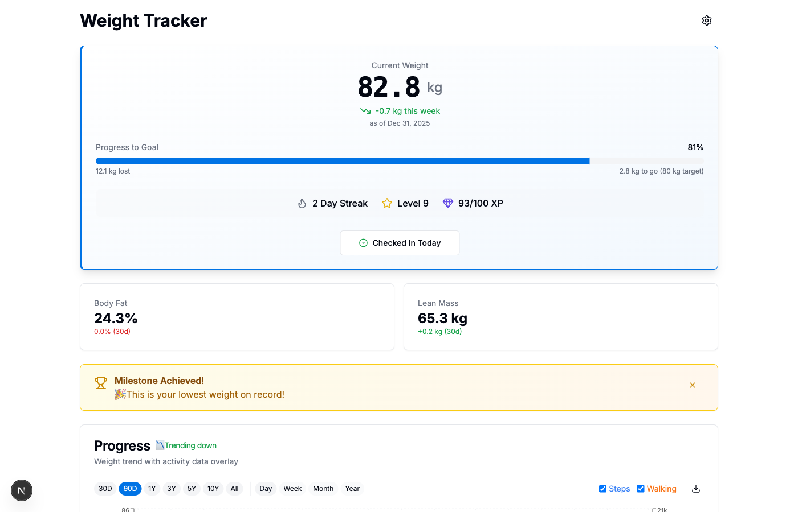

# HealthPulse

A personal weight and health tracking dashboard for Mac that integrates with Apple Health data, featuring AI coaching, gamification, and activity correlation analysis.




## Features

### Core Tracking
- **Weight Tracking**: Import weight data from Apple Health or log manually
- **Activity Integration**: Steps, workouts, flights climbed from Apple Health
- **Body Composition**: Body fat % and lean body mass (from smart scales)
- **GPS Routes**: Walking/running routes visualized on maps

### Health Metrics
- **VO2Max**: Cardiovascular fitness tracking
- **Resting Heart Rate**: Daily resting HR trends
- **HRV**: Heart rate variability for AI Coach recovery insights

### AI Coaching
- **Personalized Insights**: AI Coach powered by Claude analyzes your complete health history
- **Recovery Guidance**: Uses HRV and resting HR for training recommendations
- **Nutrition Sprint**: Time-boxed food tracking with AI calorie estimation
- **Comprehensive Context**: Coach has access to years of data for meaningful insights

### Visualization & Analysis
- **Interactive Charts**: Multi-axis charts with 30D/90D/1Y/3Y/5Y/10Y views
- **Activity Correlation**: Analyzes relationship between activity and weight changes
- **Trend Analysis**: Milestones, insights, and historical comparisons
- **Calendar Heatmaps**: GitHub-style activity visualization

### Gamification

Stay motivated with a complete gamification system:

- **XP System**: Earn experience points for healthy behaviors
  - Log weight: +10 XP
  - Hit step goal: +15 XP
  - Complete workout: +20 XP
  - Maintain streak: +5 XP per day
- **Levels**: Progress through levels as you accumulate XP (Level 1-50+)
- **Streaks**: Track consecutive days of activity with streak bonuses
- **Badges**: Unlock achievements for milestones
  - First Steps, Week Warrior, Month Master
  - Weight milestones (5kg, 10kg lost)
  - Consistency badges (30-day, 100-day streaks)
- **Daily Quests**: Fresh challenges each day to keep you engaged
- **Progress Bar**: Visual feedback on your journey to the next level

### Daily Check-ins
- **Energy Levels**: Track daily energy 1-10
- **Fasting Hours**: Log intermittent fasting
- **Notes**: Add context to any day

## Privacy & Data Security

**Your health data stays on your machine.**

### Local-First Architecture
- **All data stored locally** in SQLite database on your computer
- **No cloud sync** - you control your data completely
- **No analytics or telemetry** - we don't track usage
- **No account required** - just clone and run

### AI Coach Data Handling

When you use the AI Coach feature, your health data is sent to Anthropic's Claude API:

| Data Sent | Purpose |
|-----------|---------|
| Weight history | Trend analysis and personalized advice |
| Activity data (steps, workouts) | Activity-weight correlation insights |
| Body composition | Comprehensive health assessment |
| Resting HR, HRV | Recovery and training recommendations |

**Important considerations:**
- Data is sent **only when you explicitly ask the AI Coach a question**
- Your API key is stored locally in your database (never transmitted to us)
- Anthropic's [data usage policy](https://www.anthropic.com/policies/privacy-policy) applies
- You can use the app without the AI Coach feature

### Recommendations
- Review Anthropic's privacy policy before using AI Coach
- Don't include sensitive personal information in check-in notes
- Your `.env.local` file (with personal medical context) is gitignored

## Tech Stack

- **Frontend**: Next.js 15, React 19, TypeScript, Tailwind CSS, shadcn/ui
- **Charts**: Recharts
- **Database**: SQLite with Drizzle ORM
- **AI**: Anthropic Claude API (Sonnet 4.5)
- **Maps**: Leaflet for GPS route visualization

## Getting Started

### Prerequisites

- Node.js 18+
- npm or yarn
- Mac (optimized for desktop use)

### Installation

```bash
# Clone the repository
git clone https://github.com/eprouveze/HealthPulse.git
cd HealthPulse

# Install dependencies
npm install

# Start development server (runs on port 4000)
npm run dev
```

### Import Apple Health Data

1. Export your Apple Health data from iPhone (Health app → Profile → Export All Health Data)
2. Extract the ZIP file
3. Copy the entire `apple_health_export` folder to `imports/` in the project
4. Run the import:

```bash
npm run import
```

The import script:
- Creates automatic backups before importing
- Deduplicates data from multiple devices (iPhone + Apple Watch)
- Imports: weights, steps, workouts, sleep, resting HR, body composition, VO2Max, HRV, GPS routes
- **Safe**: Settings, goals, and check-ins are never modified

### Database Commands

```bash
npm run db:generate   # Generate migrations from schema changes
npm run db:migrate    # Run pending migrations
npm run db:studio     # Open Drizzle Studio GUI
```

## Configuration

### AI Coach Setup

The AI Coach requires an Anthropic API key:

1. Get your API key from [console.anthropic.com](https://console.anthropic.com)
2. Click the Settings icon in the app
3. Enter your API key and click Save

### Personal Context (Optional)

For personalized AI coaching, create a `.env.local` file (see `.env.local.example`):

```env
PERSONAL_MEDICAL_CONTEXT="Your personal health context for the AI coach"
```

This file is gitignored and stays on your local machine only.

## Project Structure

```
src/
├── app/
│   ├── api/           # API routes (weights, stats, coach, etc.)
│   └── page.tsx       # Main dashboard
├── components/
│   ├── ui/            # shadcn/ui components
│   ├── weight-activity-chart.tsx
│   ├── gamification-panel.tsx
│   ├── activity-panel.tsx
│   ├── nutrition-sprint.tsx
│   └── lifestyle-tracker.tsx
└── lib/
    ├── schema.ts      # Drizzle database schema
    ├── db.ts          # Database connection
    ├── analysis.ts    # Trend analysis logic
    └── gamification.ts # XP and badge calculations

scripts/
├── import-apple-health.ts  # Apple Health XML parser
├── generate-demo-data.ts   # Generate demo data for testing
└── watch-import.ts         # Auto-import watcher
```

## License

MIT
